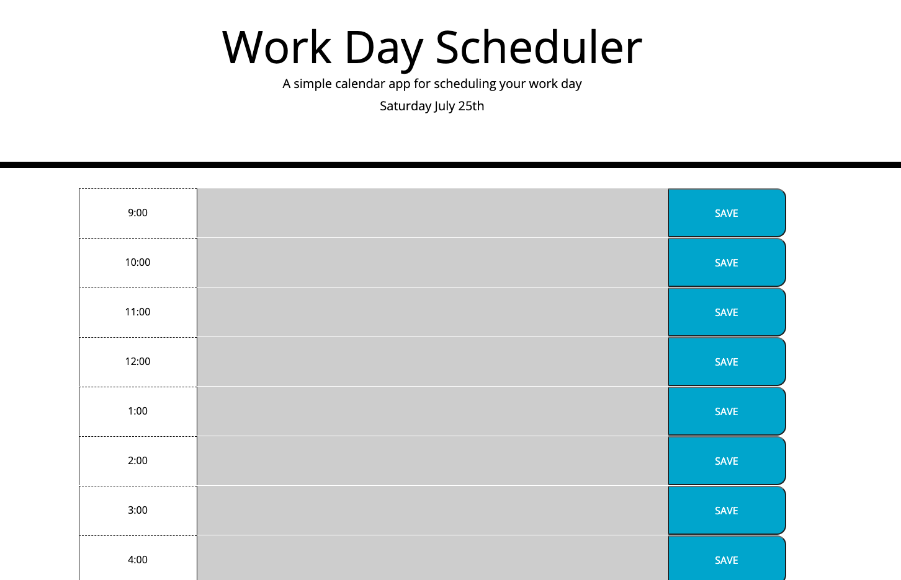
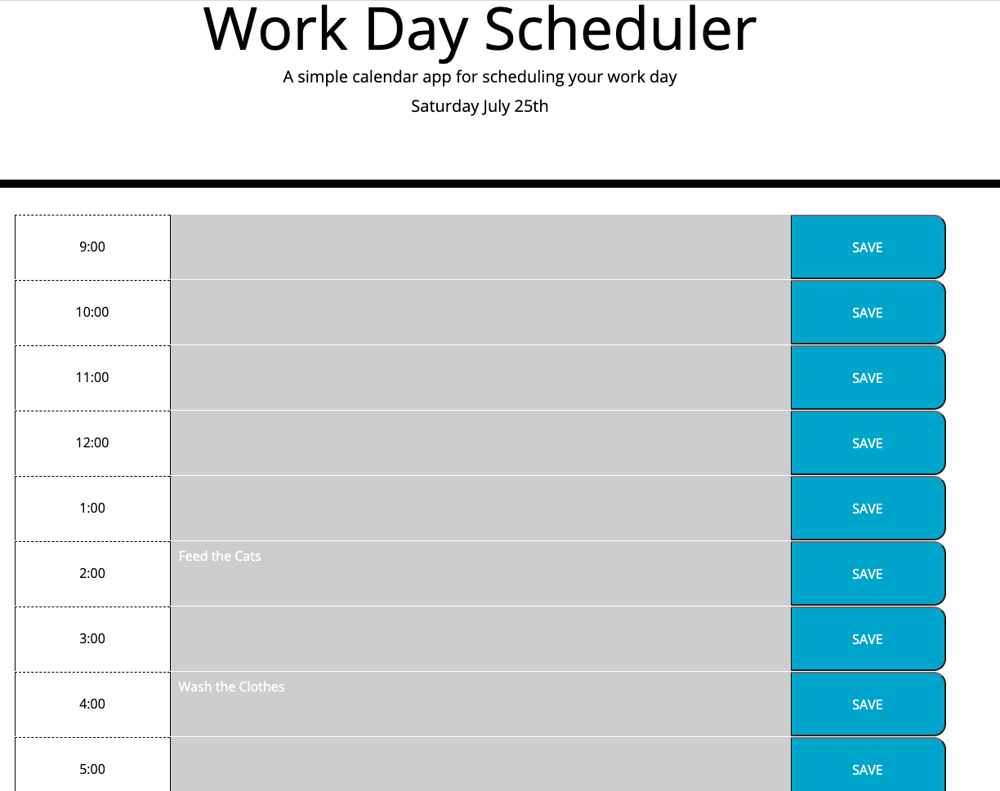

# Work Day Scheduler

 A simple calendar application that allows the user to save events for each hour of the day. This app will run in the browser and feature dynamically updated HTML and CSS powered by jQuery.
 The Save button will save your data to the local browser, even after page refresh or browser shut down, data will persist
 The Calendar updates throughout the day, so you always know how much time you have left, or what slots you can still fill




## User Story

```
AS AN employee with a busy schedule
I WANT to add important events to a daily planner
SO THAT I can manage my time effectively
```

## Contributors
Jahugawugasuga

## Technology
CSS, jQuery, Javascript, HTML, Moment JS, Local Storage



## Future Dev
Add full month calendar view
Add Week Calendar View

